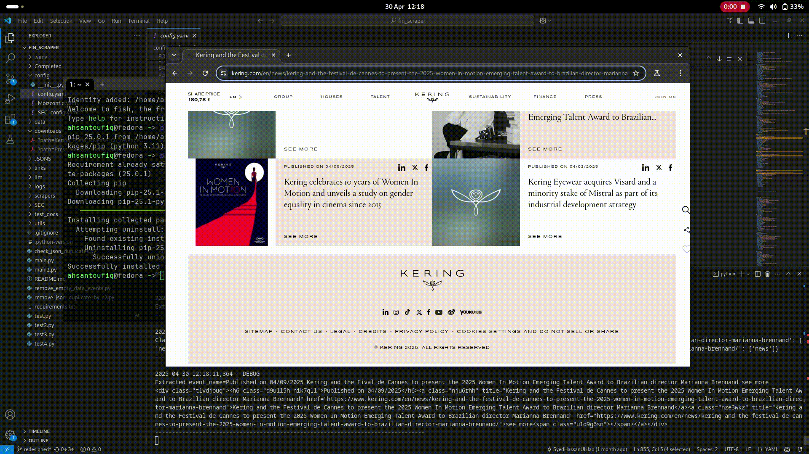

# Fin Scraper

Fin Scraper is a powerful and versatile tool designed to extract and store documents related to equities, such as financial/SEC filings, press releases, and more. It has been rigorously tested on a diverse set of 500 well-established equity websites from the US and European regions, as well as EDGAR, demonstrating its generic and robust capabilities.

## Demo

## Features

- Extract financial/SEC filings, press releases, and other equity-related documents.
- Proven compatibility with a wide range of equity websites, including EDGAR.
- Stores scraped data in a NoSQL JSON format using MongoDB.
- Highly customizable and extensible to meet diverse scraping needs.

## Why Choose Fin Scraper?

Fin Scraper's proven performance across a large and diverse set of equity websites ensures its reliability and adaptability. Whether you're working with US-based, European, or EDGAR-listed equities, this tool is designed to handle it all seamlessly.

## License

This project is licensed under the MIT License. See the [LICENSE](LICENSE) file for details.
